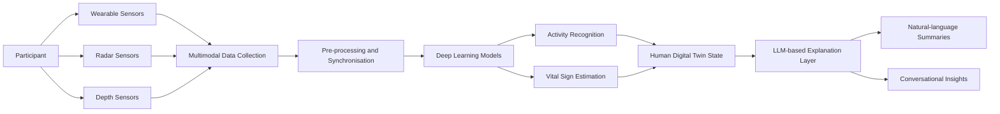
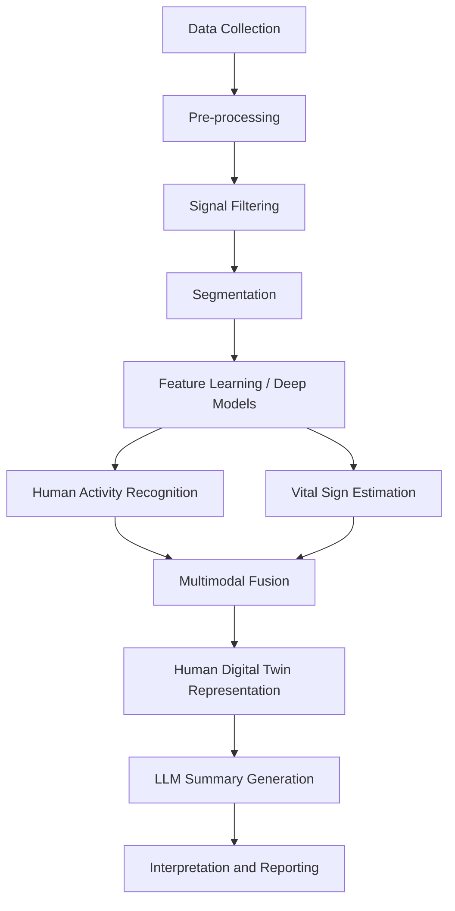
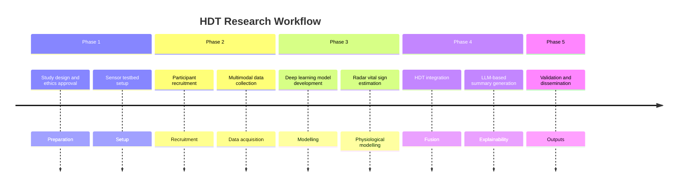

# Human Digital Twin Intelligence Platform

<div align="center">

# 🧠 Human Digital Twin Intelligence
### *Integrating Multimodal AI and Generative Models for Non-Intrusive Health and Activity Monitoring*


</div>

---

## 📌 Overview

This repository contains the research code, documentation, and experimental workflow for developing a **Human Digital Twin (HDT)** platform that combines:

- **Multimodal sensing**
- **Deep learning**
- **Radar-based vital sign monitoring**
- **Large Language Models (LLMs)**

The goal is to enable **privacy-preserving**, **non-intrusive**, and **interpretable** monitoring of human activity, behaviour, vital signs, and well-being in real-world indoor environments such as homes, workplaces, laboratories, community health spaces, and aged-care settings.

---

## ✨ Key Features

- 🏃 **Human Activity Recognition (HAR)** using wearable and environmental sensing
- 📡 **Radar-based vital sign monitoring** for non-contact sensing
- ❤️ **Wearable physiological sensing** for reference measurement and multimodal fusion
- 🤖 **Deep learning models** for activity and physiological pattern analysis
- 💬 **LLM-powered explanations** for natural-language summaries and conversational insights
- 🔒 **Privacy-aware design** with reduced reliance on intrusive sensing modalities
- 📊 **Research-ready evaluation pipeline** for accuracy, reliability, interpretability, and trust

---

## 🎯 Research Aims

This project aims to:

1. Develop a multimodal sensing framework for **human activity recognition**.
2. Estimate **vital-sign indicators** using radar-based and wearable sensing.
3. Fuse wearable, radar, and environmental sensor data into a **Human Digital Twin** model.
4. Use deep learning to recognise **physical activities** and **behavioural patterns**.
5. Use LLMs to generate **interpretable, conversational summaries** of system outputs.
6. Evaluate model **accuracy, reliability, usability, interpretability, and user trust**.
7. Create an **ethically managed multimodal dataset** for future AI and digital health research.

---

## 🏗️ System Architecture



---

## 🧩 Sensing Modalities

| Modality | Example Device / Source | Purpose |
|---|---|---|
| **IMU sensors** | Body-worn inertial sensors | Capture acceleration, orientation, and movement patterns |
| **mmWave radar** | Radar sensing platform | Support non-contact motion analysis and vital sign monitoring |
| **Hexoskin smart vest** | Wearable smart garment | Record respiration, heart rate, and related physiological signals |
| **Depth sensors** | Depth camera / depth sensing device | Capture non-identifiable posture and body movement structure |
| **Wearable ECG / heart-rate devices** | Reference wearable device | Provide physiological reference measures for validation |

---

## 🔄 AI and Data Analysis Pipeline



### Pipeline Stages

#### 1. Data Collection
Participants perform functional physical activities while data are collected from wearable and environmental sensors.

#### 2. Pre-processing
Sensor streams are synchronised, cleaned, filtered, and segmented into fixed-length time windows.

#### 3. Human Activity Recognition
Deep learning models classify activities such as:
- sitting
- standing
- walking
- lying
- transitional movements

#### 4. Vital Sign Estimation
Radar and wearable data are analysed to estimate indicators such as:
- breathing-rate patterns
- heart-rate-related patterns
- physiological variation over time

#### 5. Multimodal Fusion
Activity, context, and physiological signals are fused into an HDT representation.

#### 6. LLM-based Explanation
LLMs convert processed outputs into natural-language summaries, explanations, and conversational responses.

#### 7. Evaluation
Performance is assessed using classification, estimation, agreement, usability, and trust metrics.

---

## 💬 Role of Large Language Models

LLMs make the Human Digital Twin easier to understand for researchers, participants, and future users.

They may support:

- Plain-language summaries of activity and vital sign patterns
- Explanations of why the system inferred a particular activity or physiological trend
- Conversational interaction with processed HDT outputs
- Structured reports for researchers or health professionals
- Improved transparency and usability of AI-generated outputs

> **Important:** LLMs are **not** used to make clinical diagnoses or provide medical advice.  
> They are constrained to processed, anonymised, and validated system outputs.

---

## 🧠 Example HDT Output

```text
During the activity session, the participant completed several transitions from sitting to standing and walking. 
The system detected mostly light-intensity movement, with stable breathing-rate trends during seated and standing activities. 
Increased movement variability was observed during walking tasks.
```

This type of summary is intended to make technical model outputs easier to interpret while preserving privacy and avoiding unsupported clinical claims.

---

## 📂 Repository Structure

```text
hdt-intelligence/
├── data/                   # Data storage placeholders; raw participant data are not committed
├── docs/                   # Project documentation, protocols, ethics-related material
├── notebooks/              # Exploratory analysis and model development notebooks
├── src/
│   ├── preprocessing/      # Cleaning, filtering, synchronisation, segmentation
│   ├── models/             # Deep learning and multimodal fusion models
│   ├── radar/              # Radar signal processing and vital sign estimation
│   ├── imu/                # IMU processing and HAR modules
│   ├── llm/                # LLM summarisation and explanation components
│   └── evaluation/         # Metrics, validation, and visualisation utilities
├── tests/                  # Unit and integration tests
├── configs/                # Experiment and model configuration files
├── scripts/                # Training, evaluation, and data-processing scripts
├── requirements.txt        # Python dependencies
├── environment.yml         # Optional conda environment file
└── README.md
```

---

## 🚀 Installation

> Installation instructions can be refined as the codebase matures.

### Clone the repository

```bash
git clone https://github.com/<your-org>/<your-repo>.git
cd <your-repo>
```

### Create a Python virtual environment

```bash
python -m venv .venv
source .venv/bin/activate
```

### Install dependencies

```bash
pip install -r requirements.txt
```

### Optional: Conda environment

```bash
conda env create -f environment.yml
conda activate hdt-intelligence
```

---

## ▶️ Example Workflow

```bash
# Pre-process multimodal sensor data
python scripts/preprocess_data.py --config configs/preprocessing.yaml

# Train a human activity recognition model
python scripts/train_har_model.py --config configs/har_model.yaml

# Estimate radar-based vital signs
python scripts/run_vital_sign_estimation.py --config configs/radar_vitals.yaml

# Generate an LLM-based summary from processed outputs
python scripts/generate_summary.py --input outputs/session_results.json
```

---

## 📈 Evaluation Metrics

### Human Activity Recognition

- Accuracy
- Precision
- Recall
- F1-score
- AUC-ROC
- Confusion matrices
- Leave-one-subject-out validation
- k-fold cross-validation

### Vital Sign Estimation

- Mean absolute error (MAE)
- Root mean squared error (RMSE)
- Correlation coefficients
- Intraclass correlation coefficients (ICC)
- Bland-Altman analysis
- Agreement with wearable or ECG-derived reference data

### Explainability and Usability

- Participant feedback
- Researcher feedback
- Explanation clarity
- Perceived trust
- Usability assessment
- Expert review of LLM-generated summaries

---

## 🗺️ Research Workflow at a Glance



---

## 🔐 Data Governance and Ethics

This project involves **human participant data** and must be conducted under appropriate ethics approval.

### Core principles

- Raw participant data must **not** be committed to this repository.
- Identifiable or sensitive data must be stored in approved institutional systems.
- Data should be anonymised or de-identified before analysis where possible.
- Access must be restricted to authorised research personnel.
- LLM-based summaries must use only processed and approved system outputs.
- The system must **not** provide clinical diagnosis or medical advice.

---

## ⚠️ Privacy and Safety Notes

This platform is a **research prototype**. It is **not a medical device** and should not be used for clinical decision-making without further validation, regulatory review, and appropriate governance.

Radar, wearable, and depth-sensing outputs may contain uncertainty. All AI-generated classifications, vital-sign estimates, and LLM summaries should be reviewed carefully and interpreted within the limits of the study design.

---

## 🛠️ Technologies

The project may use:

- Python
- PyTorch
- TensorFlow
- NumPy
- SciPy
- pandas
- scikit-learn
- Matplotlib
- Radar signal-processing libraries
- Wearable and sensor SDKs
- LLM APIs or locally hosted language models

---

## 👥 Team and Collaborators

This project is led by researchers at **Auckland University of Technology (AUT)**, bringing together expertise in:

- Artificial intelligence
- Pervasive computing
- Human activity recognition
- Wireless and radar sensing
- Vital sign monitoring
- Human-computer interaction
- Public health
- Physical activity and well-being
- Responsible and explainable AI

---

## 💰 Funding

This work is associated with the **DCT Project Development Fund 2026** project:

**Human Digital Twin Intelligence: Integrating Multimodal AI and Generative Models for Non-Intrusive Health and Activity Monitoring**

---

## 📚 Citation

If you use this repository or build on this work, please cite the project or associated publications once available.

```bibtex
@misc{hdt_intelligence_2026,
  title        = {Human Digital Twin Intelligence: Integrating Multimodal AI and Generative Models for Non-Intrusive Health and Activity Monitoring},
  author       = {Yongchareon, Sira and collaborators},
  year         = {2026},
  institution  = {Auckland University of Technology},
  note         = {Research project repository}
}
```

---

## 📄 License

The license for this repository will be confirmed before public release.

Recommended options:

- **MIT License** for open-source research code
- **Creative Commons** license for documentation
- Restricted access terms for datasets involving human participant data

---

## 📫 Contact

**A/Prof. Sira Yongchareon**  
Auckland University of Technology  
AUT AI Research Centre  
Email: **sira.yongchareon@aut.ac.nz**
