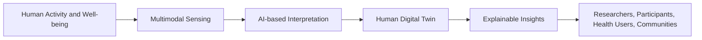
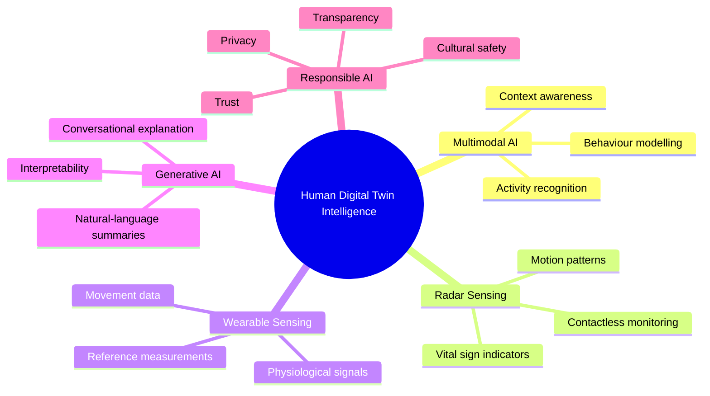
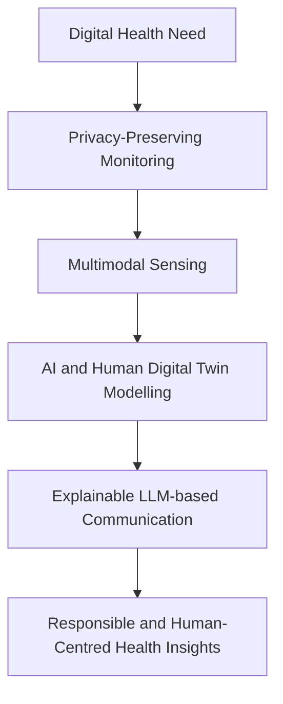

# 🧠 Human Digital Twin Intelligence
### *Multimodal AI and Generative Models for Non-Intrusive Health and Activity Monitoring*

---

## 📌 Project Overview

**Human Digital Twin Intelligence** is a proposed research project focused on developing the foundations for a privacy-preserving, explainable, and human-centred Human Digital Twin (HDT) for health and activity monitoring.

The project explores how multimodal sensing, wearable technologies, radar-based vital sign monitoring, deep learning, and Large Language Models (LLMs) can be brought together to better understand human activity, behaviour, physiological responses, and well-being in real-world indoor environments.

The long-term vision is to support non-intrusive digital health technologies that can provide meaningful, interpretable, and ethically responsible insights for individuals, researchers, health professionals, and communities.

---

## 🌍 Background and Motivation

Recent advances in ubiquitous computing, wearable sensing, wireless sensing, and artificial intelligence have created new opportunities for continuous monitoring of human activity and health.

However, many existing human activity recognition and health-monitoring systems remain limited in several ways:

- They often rely on a single sensing source.
- Some approaches use intrusive sensing technologies.
- Sensor outputs are often difficult for non-technical users to interpret.
- AI models frequently operate as black boxes.
- Existing systems may not adequately account for context, privacy, cultural expectations, or user trust.

This project responds to these limitations by investigating a more integrated and explainable approach to digital health monitoring.

Instead of treating activity, context, and physiological signals separately, the project considers how they may be connected through a Human Digital Twin: a dynamic digital representation that can model aspects of a person’s activity and well-being over time.

---

## ❓ Research Problem

Current activity recognition and health-monitoring systems are often fragmented, intrusive, and difficult to interpret. They may detect movement or physiological patterns, but they do not always explain what those patterns mean or why the system reached a particular inference.

The central research problem is:

> **How can multimodal sensing and Generative AI be integrated to create a privacy-preserving and explainable Human Digital Twin capable of modelling and communicating human activity, vital signs, and well-being in real-world environments?**

---

## 🎯 Project Aim

The aim of this project is to investigate the foundations of an AI-driven Human Digital Twin platform that can combine non-intrusive environmental sensing, wearable sensing, radar-based vital sign monitoring, and Generative AI to support interpretable health and activity monitoring.

The project is concerned not only with technical accuracy, but also with transparency, usability, privacy, and responsible deployment.

---

## 🧭 Key Objectives

The proposed research has four main objectives:

1. **Develop a multimodal understanding of human activity and context**  
   Explore how different sensing sources can contribute to recognising physical activity, posture, movement, and behavioural patterns.

2. **Investigate radar-based vital sign monitoring**  
   Examine how radar sensing can support contactless monitoring of physiological indicators such as breathing-related and heart-related patterns.

3. **Link behavioural and physiological indicators**  
   Study how activity patterns and vital-sign indicators may be connected within a Human Digital Twin representation.

4. **Use LLMs for explainable and conversational insights**  
   Investigate how Large Language Models can convert complex sensor and AI outputs into clear, human-readable summaries and explanations.

---

## 🧠 Conceptual Vision

The project vision is to move from raw sensing signals toward meaningful, interpretable, and privacy-aware digital health insights.

---

## 🧩 Core Research Themes

---

## 📡 Multimodal Sensing Perspective

The project considers multiple complementary sensing modalities, including:

| Sensing Modality | Research Role |
|---|---|
| **Wearable inertial sensors** | Support movement and activity recognition |
| **Radar sensing** | Enable non-contact activity and vital sign monitoring |
| **Smart physiological garments** | Provide wearable reference signals such as breathing and heart-rate measures |
| **Depth sensing** | Support non-identifying posture and movement analysis |
| **Wearable physiological devices** | Provide additional reference measures for health-related signals |

The focus is on how these modalities may contribute to a richer and more contextual understanding of human activity and well-being.

---

## 💬 Role of Large Language Models

Large Language Models are important because they can help make Human Digital Twin outputs understandable.

In this project, LLMs are considered as an explanation layer that may help translate technical outputs into natural language. For example, instead of only reporting an activity label or a numerical signal, an LLM could generate a summary such as:

> The participant showed a period of light activity followed by seated rest. Breathing-rate indicators appeared more stable during the resting period than during movement.

LLMs may support:

- Explanation of activity and vital-sign patterns
- Plain-language summaries of multimodal AI outputs
- Conversational interaction with processed Human Digital Twin information
- Improved transparency for non-technical users
- Better communication between AI systems, researchers, and future health users

LLMs are not intended to provide medical diagnosis or replace professional clinical judgement.

---

## ⚠️ Key Challenges

This project addresses several important scientific and practical challenges.

### 1. Multimodal Data Fusion

Human behaviour is complex and cannot be fully understood through a single sensor. A key challenge is how to combine wearable, radar, and environmental sensing data in a coherent and reliable way.

### 2. Privacy-Preserving Monitoring

Health and activity monitoring can easily become intrusive. The project therefore emphasises non-intrusive sensing and privacy-aware design.

### 3. Radar-Based Vital Sign Interpretation

Radar can support contactless physiological monitoring, but vital-sign estimation is technically challenging because signals may be affected by movement, posture, distance, noise, and environmental conditions.

### 4. Explainability and Trust

Even accurate AI models may be difficult to trust if their outputs are opaque. A major challenge is to make AI reasoning understandable without oversimplifying or overclaiming.

### 5. Human-Centred Design

A Human Digital Twin must be useful and meaningful to people, not only technically sophisticated. This requires attention to usability, interpretability, participant experience, and future stakeholder needs.

### 6. Ethical and Cultural Responsibility

Digital health technologies must respect privacy, autonomy, data sovereignty, and cultural values. This is particularly important in the Aotearoa New Zealand context, where responsible AI must align with Te Tiriti principles and support equitable outcomes.

---

## 🌱 Importance of the Project

This research is important because it contributes to the development of future digital health systems that are more:

- **Non-intrusive** — reducing reliance on invasive or privacy-sensitive monitoring.
- **Personalised** — modelling activity and physiological patterns in relation to individual contexts.
- **Explainable** — making AI outputs easier to understand.
- **Human-centred** — designing systems around people rather than technology alone.
- **Ethically responsible** — foregrounding privacy, transparency, trust, and cultural appropriateness.
- **Scalable** — creating foundations for future applications in homes, workplaces, community spaces, and aged-care environments.

---

## 🔬 Research Significance

The project has potential significance across several domains.

### Research Significance

It can advance knowledge in multimodal AI, human activity recognition, radar-based vital sign monitoring, Human Digital Twins, and explainable AI.

### Health and Well-being Significance

It may support future systems for recognising patterns related to physical activity, sedentary behaviour, physiological variation, and well-being.

### Technological Significance

It contributes to the development of integrated digital health platforms that combine sensing, AI modelling, and natural-language explanation.

### Social Significance

It supports a future in which health-monitoring technologies are more accessible, interpretable, and privacy-aware.

### Māori and Pacific Relevance

The project emphasises responsible data use, community trust, and culturally appropriate approaches to digital health innovation. It aligns with values such as kaitiakitanga, manaakitanga, rangatiratanga, and hauora.

---

## 🧭 Project Positioning

The project sits at the intersection of digital health, AI, sensing technologies, human-computer interaction, and responsible innovation.

---

## 🏛️ Institutional Context

This project is associated with the **DCT Project Development Fund 2026** research proposal:

**Human Digital Twin Intelligence: Integrating Multimodal AI and Generative Models for Non-Intrusive Health and Activity Monitoring**

The project is led by researchers at **Auckland University of Technology (AUT)** and brings together expertise in:

- Artificial intelligence
- Pervasive computing
- Human activity recognition
- Wireless and radar sensing
- Vital sign monitoring
- Human-computer interaction
- Public health
- Physical activity and well-being
- Responsible and explainable AI

---

## 🔑 Keywords

`Human Digital Twin` · `Multimodal AI` · `Digital Health` · `Human Activity Recognition` · `Radar Sensing` · `Vital Sign Monitoring` · `Wearable Sensing` · `Explainable AI` · `Large Language Models` · `Responsible AI`

---

## 📫 Contact

**A/Prof. Sira Yongchareon**  
Auckland University of Technology  
AUT AI Research Centre  
Email: **sira.yongchareon@aut.ac.nz**
