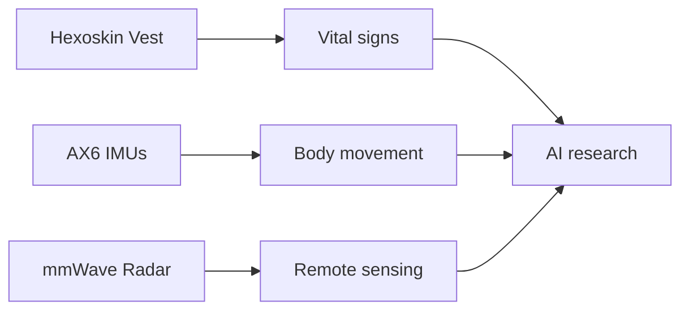
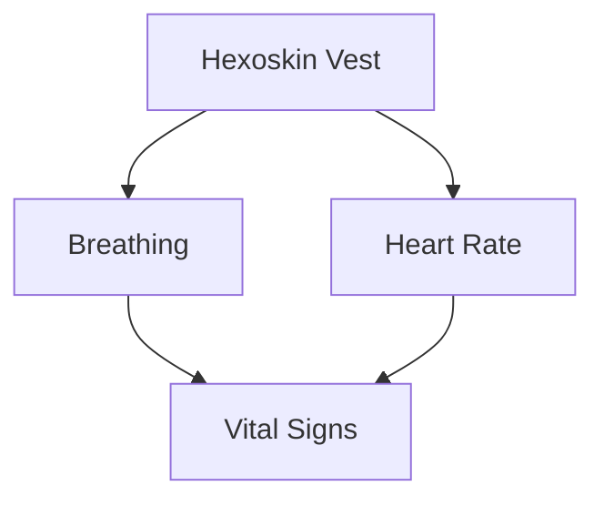
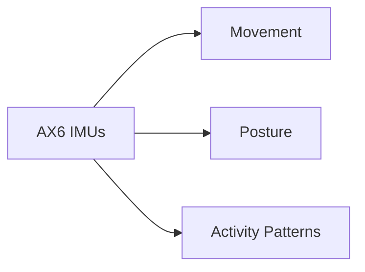
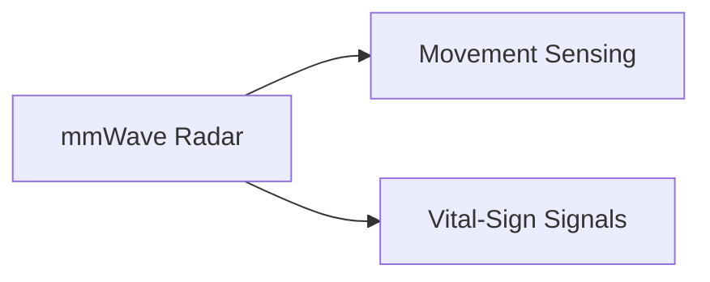
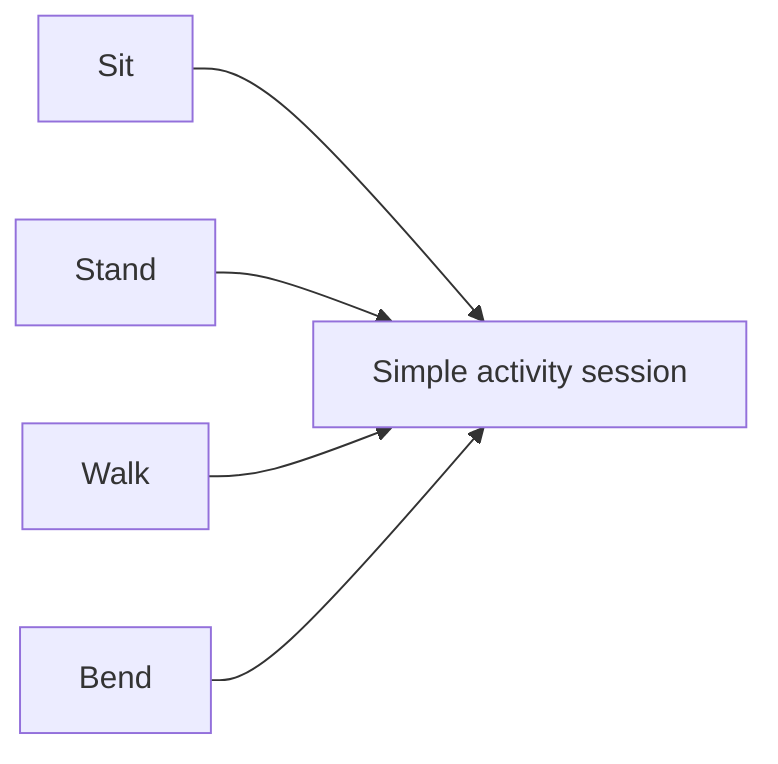
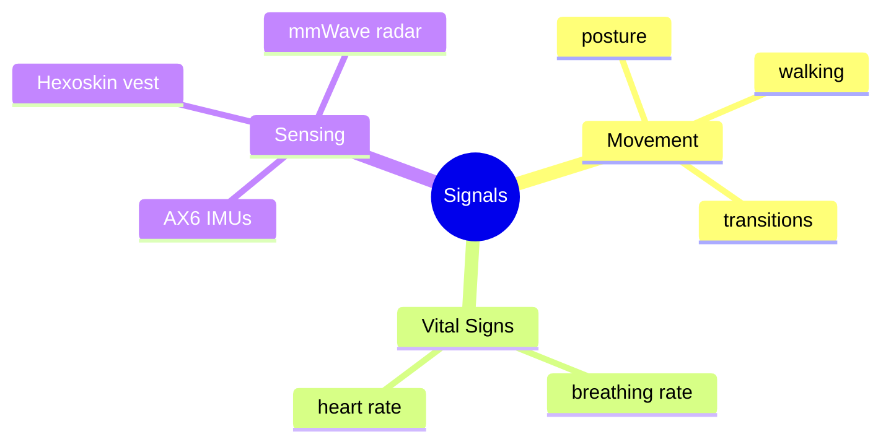

# Participants Wanted

# 🧠 Human Digital Twin Intelligence Study
### Help us improve AI for smart health and activity monitoring

**Take part in a short AUT research study and receive a gift voucher for your time.**

---

## 🌟 Why take part?

We are inviting healthy adults to help us develop future AI tools for:

- **understanding human movement**
- **monitoring vital signs**
- **supporting non-intrusive health technology**

Your participation will help us improve technologies that use **wearable sensors**, **mmWave radar**, and **artificial intelligence**.

---

## 👤 Who can join?

You may be able to take part if you are:

- an **adult**
- able to perform **everyday physical activities**
- comfortable attending **one session at AUT**

---

## 🎁 What do participants receive?

Participants will receive a **gift voucher** as a thank you for taking part.

---

## 📍 Where and how long?

- **Location:** AUT WZ Level 1 Engineering Laboratory  
- **Duration:** Approximately **1 hour**  
- **Dates/times:** **Flexible**

---

## 🧪 What does the study involve?

You will be invited to take part in a short session where you may be asked to:

- wear a **Hexoskin smart vest**
- wear a few **small AX6 IMU movement sensors**
- be monitored by an **mmWave radar sensor**
- perform simple **everyday physical activities** such as sitting, standing, and walking

You can ask questions before deciding whether to take part.

---

# 📡 Study Technology at a Glance

---

## ❤️ Hexoskin Smart Vest

The Hexoskin vest is a wearable vest used to record **vital signs**, such as:

- breathing rate
- heart rate

---

## 📍 AX6 IMU Sensors

AX6 IMUs are small wearable movement sensors placed on the body to help record **motion and activity**.

They help us study:

- posture
- movement
- activity patterns

---

## 📶 mmWave Radar

The mmWave radar sensor is used for **remote sensing**.

It helps us study:

- body movement
- motion patterns
- vital-sign-related signals

---

## 🏃 Physical Activities

During the session, you may be asked to do simple activities such as:

- sitting
- standing
- walking
- bending
- light functional movements

---

## 💓 What kinds of signals are we interested in?

---

## 🔐 Your privacy

Your privacy is important to us.

- Your information will be handled confidentially.
- Study data will be securely stored.
- Participation is voluntary.
- You may choose not to take part.

---

## 💬 Interested or want to learn more?

Please contact:

### **Dr. Anuradha Singh**  
**Email:** anuradha.singh@aut.ac.nz  
**Mobile:** 022 496 2385

---

## ✉️ Get in touch

If you would like to:

- ask a question
- check if you are eligible
- express interest
- arrange a session

please contact **Dr. Anuradha Singh**.

---

## 🙌 We would love to hear from you

**Join our study • Help advance AI research • Receive a gift voucher**

