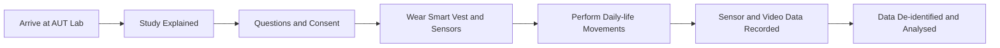

# Participant Recruitment

# 🧠 Participants Wanted  
## Human Digital Twin Intelligence Study

### Help us develop AI tools for non-intrusive activity and vital sign monitoring

---

## 📌 About the Study

You are invited to take part in a research study conducted by researchers at **Auckland University of Technology (AUT)**.

This study explores how artificial intelligence can better understand **human activities** and **vital signs** using radar and wearable motion sensors. These technologies may help support future systems for human activity recognition, fitness tracking, and non-intrusive health monitoring.

Your participation will help researchers collect real-world data to develop and evaluate AI models for recognising everyday movements and estimating vital-sign patterns.

---

## 🎯 Study Aim

The aim of this study is to investigate how deep learning models can use data from **radar sensors**, **wearable motion sensors**, and a **smart physiological vest** to recognise human activities and monitor vital signs.

The study focuses on:

- Human activity recognition
- Radar-based vital sign monitoring
- Wearable sensing
- AI-based interpretation of movement and physiological signals
- Future Human Digital Twin technologies for health and activity monitoring

---

## 👤 Who Can Take Part?

We are looking for approximately **30 healthy adult participants**.

You may be eligible if you:

- Are an adult
- Are physically active
- Can safely perform everyday physical movements
- Are comfortable wearing wearable sensors during the study
- Are willing to attend one study session at AUT

Participation is voluntary.

---

## 📍 Location

The study will take place at:

**AUT WZ Level 1 Engineering Laboratory**  
Auckland University of Technology

---

## ⏱️ Time Commitment

The session will take approximately:

> **1 hour**

This includes explanation of the study, consent, sensor setup, activity recording, and removal of sensors.

---

## 🧪 What Will You Be Asked to Do?

If you agree to participate, you will be asked to:

1. Attend one study session at the AUT WZ Level 1 Engineering Laboratory.
2. Read the participant information sheet and ask any questions.
3. Sign a consent form before the study begins.
4. Wear a **Hexoskin smart vest** to record vital signs such as breathing rate and heart rate.
5. Wear **five small inertial measurement unit (IMU) sensors** on selected body locations.
6. Perform a set of functional daily-life movements.
7. Be video-recorded while performing the movements so researchers can validate sensor data and AI model outputs.

---

## 🦺 Sensors Used in the Study

| Sensor / Device | Purpose |
|---|---|
| **Hexoskin smart vest** | Records physiological signals such as breathing rate and heart rate |
| **IMU sensors** | Record body movement and motion patterns |
| **Radar sensors** | Support remote, non-contact sensing of movement and vital-sign indicators |
| **Video recording** | Used only for research validation of movement labels and sensor data |

---

## 🏃 Activities You May Be Asked to Perform

You may be asked to perform everyday functional movements such as:

- Sitting
- Standing
- Walking
- Squats
- Lunges
- Bending

Each activity may last around **five minutes**.

You can stop or request a break at any time.

---

## 👕 What Should You Wear?

Please wear comfortable clothing suitable for movement, such as:

- Shorts
- T-shirt
- Comfortable exercise clothing
- Comfortable shoes

This will help researchers attach the sensors safely and appropriately.

You may request a **same-gender researcher** to help place sensors if sensors need to be attached under clothing.

---

## 🔐 Privacy and Confidentiality

Your privacy will be protected throughout the study.

- Your data will be de-identified.
- Data will be stored securely in password-protected systems.
- Video recordings will be used only by the research team for validation.
- Video recordings will not be shared outside the research team.
- Your name will not be used in research outputs.

---

## ⚠️ Risks and Discomforts

The risks involved in this study are minimal.

The sensors are small and lightweight. If adhesive is used, it will be medical-grade and hypoallergenic. If you feel uncomfortable at any point, you may ask for the sensors to be adjusted, take a break, or withdraw from the study.

---

## ✅ Benefits of Taking Part

There may be no direct personal benefit to you.

However, your participation will help advance research in:

- AI-based human activity recognition
- Radar-based vital sign monitoring
- Wearable health sensing
- Non-intrusive health and activity monitoring
- Future Human Digital Twin systems

You may request a summary of the research findings after the study is completed.

---

## 🔄 Can You Change Your Mind?

Yes.

Participation is entirely voluntary. You may withdraw from the study at any time without giving a reason.

If you withdraw, you may ask for your data to be removed unless it has already been processed into the final dataset.

---

## 🩺 What If an Injury Occurs?

In the unlikely event of a physical injury caused by participation in this study, rehabilitation and compensation may be available from the Accident Compensation Corporation (ACC), provided the incident meets the relevant legal and regulatory requirements.

---

## 📊 Study Flow

---

## 👥 Research Team

This study is conducted by researchers from the **Department of Data Science and AI** at Auckland University of Technology.

### Research Team

- **A/Prof. Sira Yongchareon**
- **Dr Anuradha Singh**
- **Dr Yanbin Liu**

### Research Assistants

- **Mohammad Shirazi**
- **Biswash Paudel**
- **Tong Wu**
- **Zhongcheng Hong**

---

## 📫 Contact Us

If you are interested in participating or would like more information, please contact the research team.

### Research Assistant Contacts

- **Mohammad Shirazi** — hossein.shirazi@aut.ac.nz  
- **Biswash Paudel** — biswash.paudel@aut.ac.nz  
- **Tong Wu** — tong.wu@aut.ac.nz  
- **Zhongcheng Hong** — zhongcheng.hong@aut.ac.nz  

### Research Supervisor

**Dr Anuradha Singh**  
Email: anuradha.singh@aut.ac.nz  
Phone: (+64 9) 921 9999 ext. 26128

---

## ❓ Concerns About the Research

If you have concerns about the nature of this project, please contact the Project Supervisor in the first instance.

If you have concerns about the conduct of the research, you may contact the Executive Secretary of AUTEC:

**Email:** ethics@aut.ac.nz  
**Phone:** (+64 9) 921 9999 ext. 6038

---

## 📝 Ethics Approval

This study will be conducted under approval from the **Auckland University of Technology Ethics Committee (AUTEC)**.

> AUTEC approval date and reference number will be inserted once confirmed.

---

## 🔑 Keywords

`Participant Recruitment` · `Human Digital Twin` · `Human Activity Recognition` · `Radar Sensing` · `Vital Sign Monitoring` · `Wearable Sensors` · `IMU Sensors` · `AI for Health` · `Digital Health`

