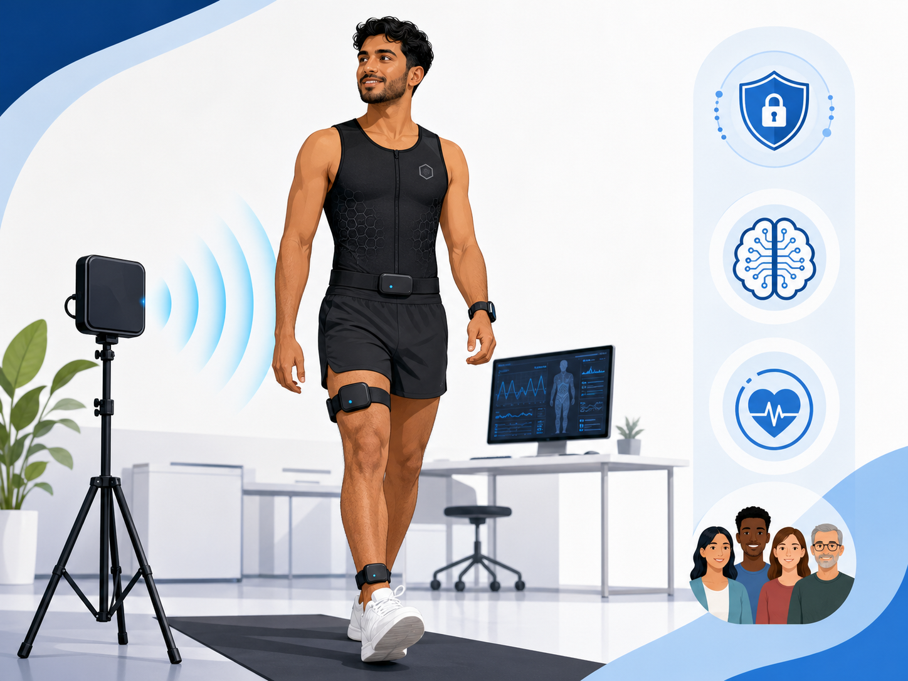
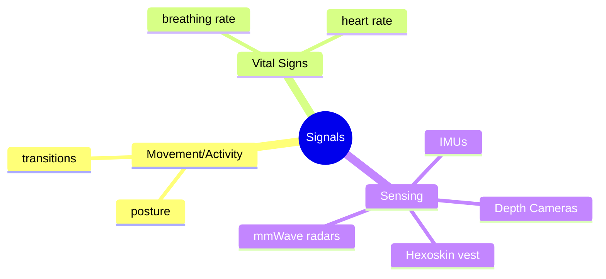

# Participants Wanted

# 🧠 Human Digital Twin Intelligence Study
### Help us improve AI for smart health and activity monitoring

**Take part in a short AUT research study and receive a gift voucher for your time.**

---

## 🌟 Why take part?

We are inviting healthy adults to help us develop future AI tools for:

- **understanding human movement**
- **monitoring vital signs**
- **supporting non-intrusive health technology**

Your participation will help us improve technologies that use **wearable sensors**, **mmWave radar**, and **artificial intelligence**.

---

## 👤 Who can join?

You may be able to take part if you are:

- an **adult**
- able to perform **everyday physical activities**
- comfortable attending **one session at AUT**

---

## 🎁 What do participants receive?

Participants will receive a **$100 gift voucher** as a thank you for taking part.

---

## 📍 Where and how long?

- **Location:** AUT City Campus, WZ Building, Level 1 Engineering Laboratory  
- **Duration:** Approximately **1 hour**  
- **Dates/times:** **Flexible.** Check available sessions or make a booking with us via https://calendly.com/aut-hdt/join

---

## 🧪 What does the study involve?

You will be invited to take part in a short session where you may be asked to:

- wear a **Hexoskin smart vest**
- wear a few **small IMU movement sensors**
- be monitored by **3D Depth Cameras and mmWave radar sensors**
- perform simple **basic functional movement activities** such as sitting, standing, and walking

You can ask questions before deciding whether to take part.

---

## 💓 What kinds of signals are we interested in?

```mermaid
mindmap
  root((Signals))
    Movement/Activity
      posture
      transitions
    Vital Signs
      breathing rate
      heart rate
    Sensing
      IMUs
      Depth Cameras
      mmWave radars
      Hexoskin vest
```

---

## 🔐 Your privacy

Your privacy is important to us.

- Your information will be handled confidentially.
- Study data will be securely stored.
- Participation is voluntary.

---

## 💬 Interested or want to learn more?

You can make a booking to participate via https://calendly.com/aut-hdt/join

Or contact:

### **Mohammad Shirazi**  
**Email:** hossein.shirazi@autuni.ac.nz  
**Mobile:** +64 2902202024

For more information: https://github.com/Ubiweb-lab/HDT-Intelligence/blob/2633072ee915200add9bb377f7df480cad63ce16/AUT%20Ethics/HDT%20Information-Sheet-V.2.2-1-July-2026.pdf

---

## 🙌 We would love to hear from you

**Join our study • Help advance AI research • Receive a gift voucher**

